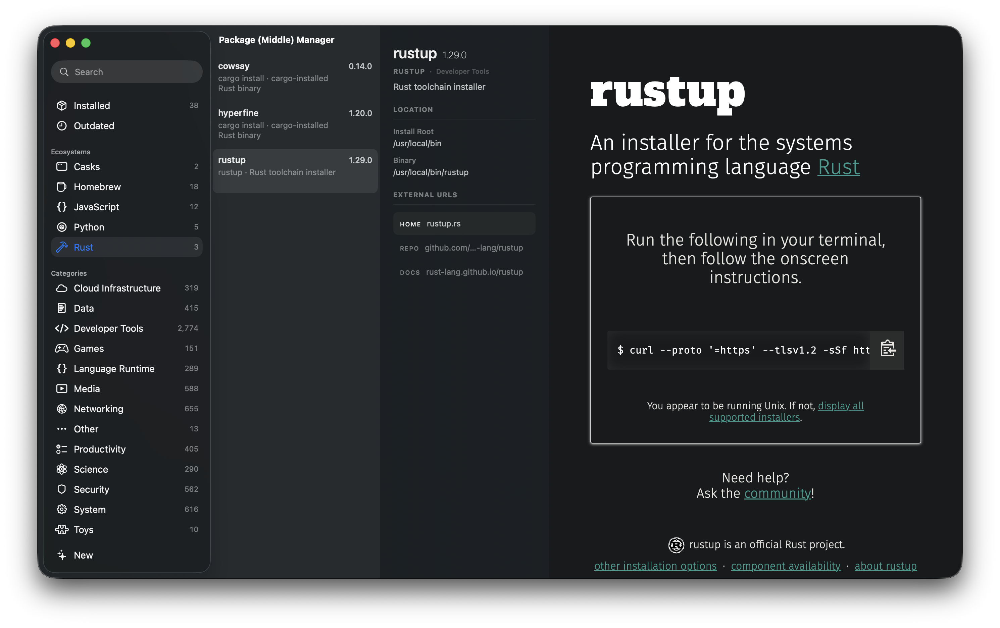

# Package Manager Manager

The time when one package manager was all you needed is long gone. PM²
inventories your package managers and their packages, so you can see what you
have, what’s outdated, and what’s taking up space.

Use whatever you want without compromising visibility into what’s going on.

> [!TIP]
> We even manage `npx foo`—no longer must you remember to do `npx foo@latest`
> every no and again to get the latest version of `foo`.

## Quickstart

```sh
$ scripts/build.sh --run
Built /Users/you/src/pmm/dist/Package Manager Manager.app
# ^^ builds the app, signs it ad-hoc, then opens it
```

Install it into `/Applications`:

```sh
$ scripts/build.sh --install --run
Built /Applications/Package Manager Manager.app
```

The app bundles a menu bar helper. The helper does the slow work in the
background, writes a snapshot to Application Support, and the main window reads
that. The UI should stay usable while your package managers do package manager
things.

## What It Finds

PM² currently inventories:

- Homebrew formulae and casks
- global npm packages
- npx cache entries
- `uv tool` tools and `uv` Python installs
- `uvx` cached environments
- `cargo install` binaries
- `rustup` and installed Rust toolchains

It also pulls package summaries, categories, URLs, and latest-version metadata
where the project has a source for it. If metadata is missing, the package still
shows up. It just looks less informed. Fair.

## Updating and Removing

The detail pane offers update and uninstall actions when PM² knows the native
command to run.

Supported update paths:

- `brew upgrade`
- `npm install --global package@latest`
- `npm exec --yes --package package@version -- true`
- `uv tool upgrade`
- `uv python install`
- `cargo install --force`

Supported uninstall paths:

- `brew uninstall`
- `npm uninstall --global`
- remove npx cache entries
- `uv tool uninstall`
- `uv python uninstall`
- remove uvx cached environments
- `cargo uninstall`

> [!IMPORTANT]
> `rustup` is inventory-only for now. PM² will show `rustup` and toolchains,
> but it will not update or uninstall them.

## CLI

There is a small CLI for the same inventory scan:

```sh
$ swift run pmmctl --help
Usage: pmmctl [--json] [--outdated]
```

Use `--json` when you want the app's package model instead of tab-separated
rows.

## Development

```sh
$ swift test

$ scripts/build.sh --run
```

The package exports three products:

- `PMMApp`, the main window
- `PMMMenuBar`, the helper/menu bar app
- `pmmctl`, the CLI

### Adding Package Managers

Keep new manager support boring and off the main thread. The menu bar helper
runs `PackageScanner.inventory(database:)` in the background, writes a
`PackageHostSnapshot`, and the main app renders that snapshot. Do not add package
manager scans, network loads, or shell commands to SwiftUI views or main-window
models.

Checklist:

- Add the manager to `PackageManagerKind` in `Sources/PMMCore/Models.swift`.
- Add one `scanX(database:)` method to `Sources/PMMCore/PackageScanner.swift`
  and call it from `inventory(database:)`. Return `[]` when the tool is missing
  or the manager has no local state.
- Build `ManagedPackage` values with stable `identifier` prefixes, readable
  `displayName`, `installedVersion`, optional `latestVersion`, and install or
  binary paths when cheap to find.
- Wire update/uninstall only when the native command is obvious:
  `PackageUpdater`, `PackageUninstaller`, and their `supports(_:)` methods.
  Inventory-only support is fine.
- Put the manager in a sidebar group in `MainWindowModel.swift` and give it a
  dashboard SF Symbol in `MainWindowDashboardView.swift`.
- Map it in `PackageDossierClient.provider(for:)` only if AutomIC Vault has a
  matching provider.
- Update the README lists under "What It Finds" and "Updating and Removing".
- Add focused tests beside the touched code: scanner parsing in
  `PackageScannerTests`, action commands in `PackageUpdaterTests` or
  `PackageUninstallerTests`, and UI grouping in `MainWindowModelTests` when a
  new section changes.

## Caveats

PM² shells out to your package managers. It does not replace them, normalize
their data perfectly, or pretend their caches are a coherent database.

Homebrew metadata requires `brew update` in the helper refresh path. Network
metadata is best-effort; local inventory should still work when that data is
unavailable.

For everything else:

```sh
$ scripts/build.sh --help
$ swift run pmmctl --help
```
